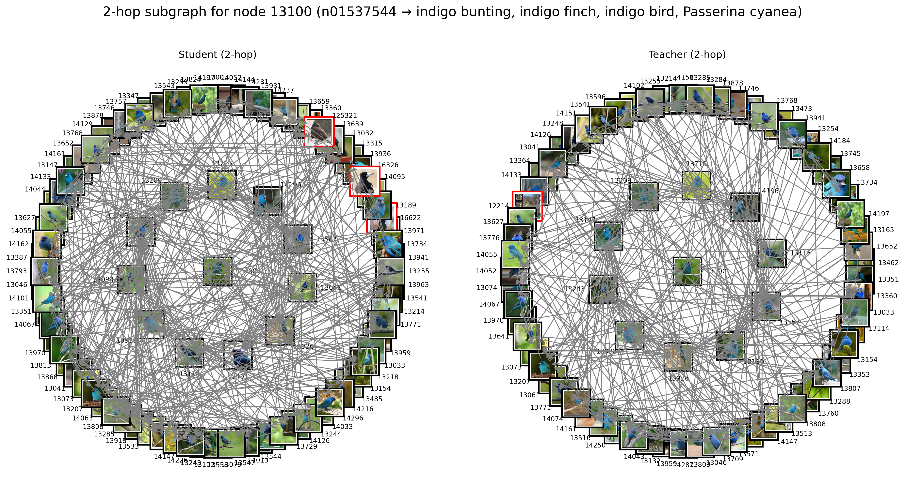
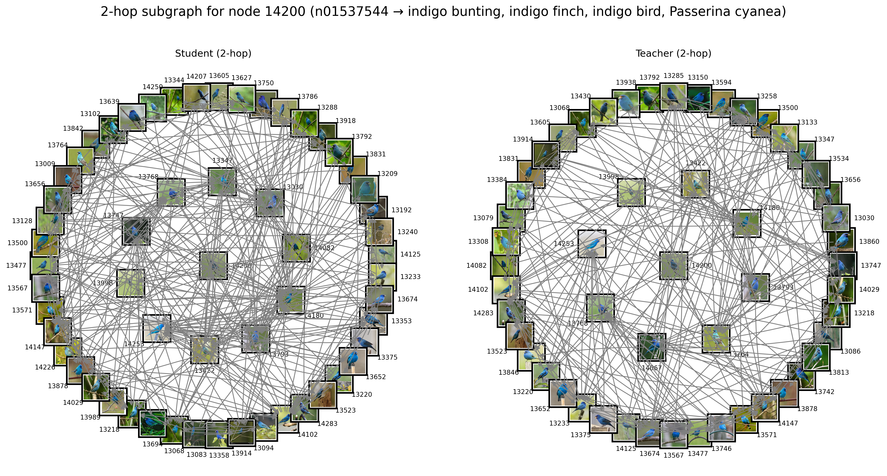
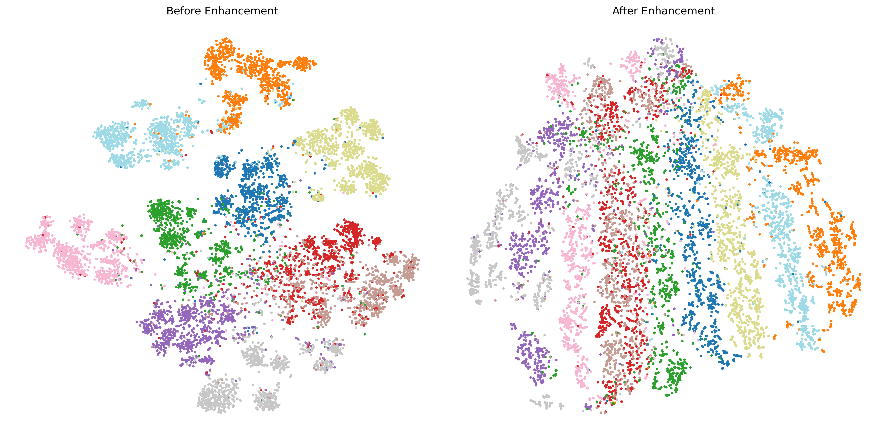
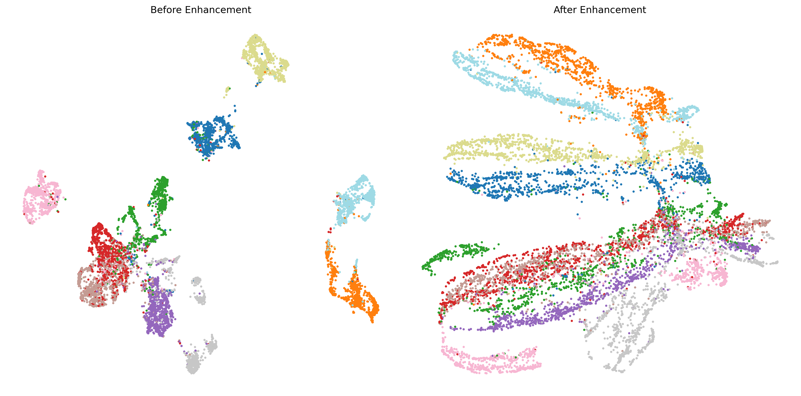

# SSL-GraphNNCLR

## Dependencies
Install all required dependencies using the requirements file:
```bash
pip install -r requirements.txt
```

## Project Structure
The project consists of three main components:
1. **Pretraining and Graph Construction** - Create teacher and student graphs
2. **Representation Refinement** - Refine node representations using the constructed graphs
3. **Visualization** - Visualize the results and analyze the refined representations

## Pretraining and Graph Construction
To pretrain the model and construct teacher and student graphs, use the `main_graphnnclr.py` script:

```bash
# For single GPU
python main_graphnnclr.py

# For multi-GPU training (e.g., 4 GPUs)
torchrun --nproc_per_node=4 main_graphnnclr.py
```

This step constructs both teacher and student graphs based on representations learned in the pretraining phase.

## Representation Refinement
The representation refinement phase is implemented in the `SelfGNN` folder. The script takes various arguments defined in `utils.py` and refines the node representations using graph neural networks:

```bash
cd SelfGNN
python src/train_graph.py
```

## Visualization
The visualization code provides two main functionalities:

1. **2-Hop Graph Visualization**: Generates visualizations of 2-hop neighborhoods for specific reference nodes. It draws black borders for correct neighbors (same class as the reference node) and red borders for incorrect neighbors.

2. **Dimensionality Reduction Visualization**: Creates t-SNE and UMAP projections to visualize how the latent space changes before and after representation refinement.

## Visualization Results

### 2-Hop Graph Visualizations
These visualizations show the 2-hop neighborhood around reference nodes. Nodes with black borders share the same class as the reference node, while nodes with red borders belong to different classes.




### Dimensionality Reduction Visualizations
These visualizations show how the latent space is transformed before and after representation refinement:




## Acknowledgments
This work builds upon several open-source projects, including [DINO](https://github.com/facebookresearch/dino) and [AdaSim](https://github.com/timtheenchanter/adasim).
