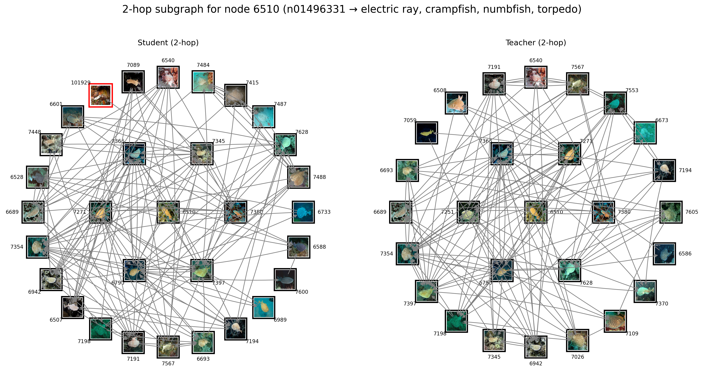

# SSL-GraphNNCLR

## Dependencies
Install all required dependencies using the requirements file:
```bash
pip install -r requirements.txt
```

## Project Structure
The project consists of three main components:
1. **Pretraining and Graph Construction** - Create teacher and student graphs
2. **Representation Refinement** - Refine node representations using the constructed graphs
3. **Visualization** - Visualize the results and analyze the refined representations
4. **Memory Consumption** – Analyze memory requirements for node and edge storage.

## Pretraining and Graph Construction
To pretrain the model and construct teacher and student graphs, use the `main_graphnnclr.py` script:

```bash
# For single GPU
python main_graphnnclr.py

# For multi-GPU training (e.g., 4 GPUs)
torchrun --nproc_per_node=4 main_graphnnclr.py
```

This step constructs both teacher and student graphs based on representations learned in the pretraining phase.

## Representation Refinement
The representation refinement phase is implemented in the `SelfGNN` folder. The script takes various arguments defined in `utils.py` and refines the node representations using graph neural networks:

```bash
cd SelfGNN
python src/train_graph.py
```

## Visualization
The visualization code provides two main functionalities:

1. **2-Hop Graph Visualization**: Generates visualizations of 2-hop neighborhoods for specific reference nodes. It draws black borders for correct neighbors (same class as the reference node) and red borders for incorrect neighbors.

2. **Dimensionality Reduction Visualization**: Creates t-SNE and UMAP projections to visualize how the latent space changes before and after representation refinement.

## Visualization Results

### 2-Hop Graph Visualizations
These visualizations show the 2-hop neighborhood around reference nodes. Nodes with black borders share the same class as the reference node, while nodes with red borders belong to different classes.




### Dimensionality Reduction Visualizations
These visualizations show how the latent space is transformed before and after representation refinement:

#### t-SNE Visualization: Before vs. After Representation Refinement


#### UMAP Visualization: Before vs. After Representation Refinement


## Memory Consumption
We provide here an estimate of the memory requirements associated with graph construction and storage.

* Node Memory Complexity
O(N × d × 4B)
where N is the number of samples (train + test), d is the feature dimensionality before the projector, and 4B corresponds to float32 storage. This term represents the dominant cost, as it stores the cached feature matrix.

* Edge Memory Complexity
O(2 × N × k × w × 4B)
where k is the number of nearest neighbors per node, w is the number of recent epochs for which neighbor lists are maintained, and the factor 2 accounts for storing both source and destination indices as 32-bit integers.

In practice, the edge term is negligible compared to the node term, since k is typically very small (1–5) and w is moderate (5–15).

Example: ImageNet-1K (N ≈ 1.3M)

* ViT-Base (d = 768) → ~3.72 GB

* ViT-Small (d = 384) → ~1.86 GB

* ViT-Tiny (d = 192) → ~0.93 GB

Since AdaSim already requires a cache of size O(N × d × 4B) for the teacher stream, our method simply maintains an additional cache for the student stream. For ImageNet-1K with ViT-Base, this corresponds to an additional ~3.72 GB, which remains practical on modern hardware.

## Acknowledgments
This work builds upon several open-source projects, including [DINO](https://github.com/facebookresearch/dino), [AdaSim](https://github.com/tileb1/AdaSim/), and [SelfGNN](https://github.com/zekarias-tilahun/SelfGNN).
